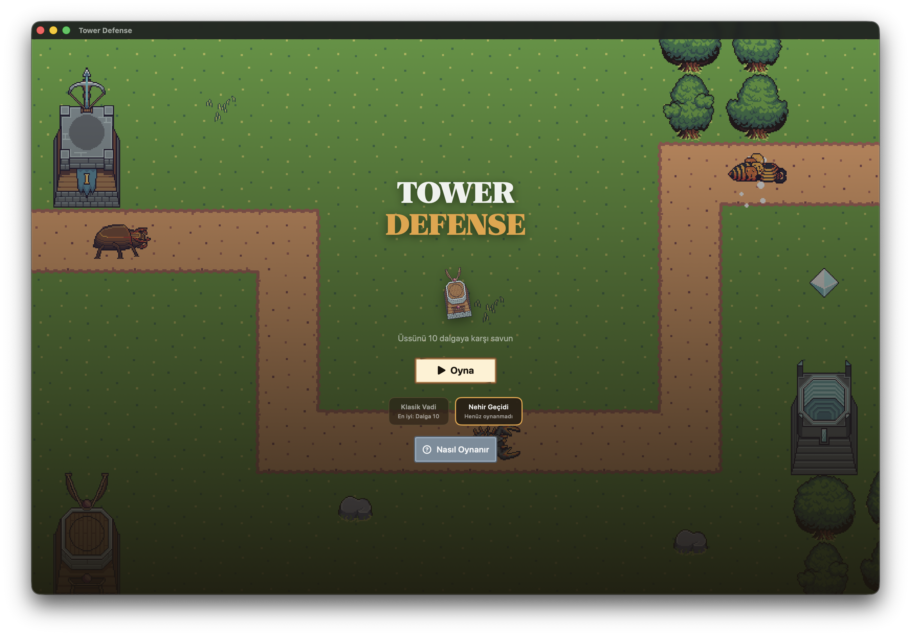

# Tower Defence

macOS ve iOS'ta native çalışan, SwiftUI + SpriteKit ile yazılmış kompakt bir tower defense oyunu.
Sprite'lar [Foozle](https://foozlecc.itch.io/) Spire serisinden, UI ve sesler [Kenney](https://kenney.nl) paketlerinden — hepsi CC0 (bkz. [CREDITS.md](CREDITS.md)).



## Oyun modları

- **Sefer** — ana mod: 50 üretilmiş seviye, 4 zorluk kademesi, yıldızlar ve kilit ilerlemesi.
- **📅 Günlük Meydan Okuma** — her gün herkese aynı, tarihe tohumlu tek seviye; günde tek deneme, ×2 Hazine.
- **∞ Sonsuz Mod** — iki el yapımı arenada (**Klasik Vadi**, köprülü **Nehir Geçidi**) bitmeyen dalgalara karşı rekor denemesi.

## Oynanış

- Üssünü düşman dalgalarına karşı savun; canların biterse kaybedersin.
- 8 kule: **Arbalet** (hızlı, ucuz), **Dikenatar** (uzun menzil, orta hasar), **Mancınık** (alan hasarı), **Burç Yayı** (uzun menzil), **Kristal** (tek hedefe yüksek hasar), **Şok** (çok hızlı, kısa menzil), **Orb** (orta alan hasarı), **Güneş Kulesi** (premium, geniş alan).
- 8 düşman: **Yaprak Böceği**, **Ateş Böceği** (hızlı), **Akrep** (zırhlı), **Kıskaç Böceği** (uçan), **Gölge Kelebeği** (uçan, hızlı), **Çekirge** (uçan, sürü), **Magma Yengeci** (zırhlı); boss dalgalarında **Ateş Eşekarısı** (uçan) gelir.
- Sürükle-bırak kule yerleştirme; sürüklerken canlı menzil önizlemesi ve kare uygunluk rengi.
- Kuleler 3 seviyeye yükseltilebilir (geometrik maliyet); %70 iadeyle satılabilir.
- Dalgalar arasında serbest inşa süresi; istersen 🔁 **otomatik dalga** ile aralıksız akış.
- Hedefleme modları: İlk, Son, En Yakın, En Güçlü. 1x/2x/3x oyun hızı.
- Hasar sayıları, isabet flaşları, satış yıkım animasyonu, müzik + ambiyans katmanı.
- Nasıl Oynanır ekranı, ilk oyun ipuçları, kulesiz dalga uyarısı ve duraklatma menüsü.

## Sefer

- 50 üretilmiş seviye: her seviye tohumlu ve deterministik üretilir (yol, nehir, dalga kompozisyonu) — aynı seviye her cihazda aynıdır.
- Yıldızlar: kalan cana göre 1-3★ (≥%90 → 3★, ≥%30 → 2★, >0 → 1★); en iyi sonuç saklanır.
- Kilit ilerlemesi: bir seviyeyi kazanmak sıradakini açar; el yapımı 2 harita Sonsuz Mod arenası olarak yaşar.

### Zorluk kademeleri

Sefer oynanırken dört kademe arasından seçim yapılır:

| Kademe    | Başlangıç canı | İnşa maliyet çarpanı | Hazine kazanç çarpanı |
|-----------|:--------------:|:--------------------:|:---------------------:|
| Normal    | 20             | ×1.00                | ×1.0                  |
| Zor       | 14             | ×1.00                | ×1.5                  |
| Çok Zor   | 10             | ×1.08                | ×2.0                  |
| Kâbus     | 3              | ×1.15                | ×3.0                  |

**Kâbus kilidi:** Kâbus kademesi bir seviyede yalnızca diğer üç kademeyi (Normal, Zor, Çok Zor) o seviyede tamamladıktan sonra açılır.

**HP eğrileri (BalanceLab ayar v3):** Her kademede düşman HP'si, seviye bazında simülasyonla ayarlanmış çarpanlar (`TunedDifficulty.swift`) ile ölçeklenir. Normal 1. seviyede çarpan 1.0×'dan başlar; 50. seviyede her kademe için ayrı bir eğri izler (ör. 50. seviyede Normal ≈3.2×, Kâbus ≈2.5×). Böylece Normal ve Kâbus arasındaki fark salt can sayısından değil, zaman içinde yoğunlaşan dalga baskısından gelir.

```bash
cd GameCore && swift run -c release BalanceLab zorluk   # kademe × seviye tablosu
```

Denge modeli BTD6/Kingdom Rush araştırmasına dayalı geometrik HP/bütçe eğrileri kullanır
(H0=120, g=1.22, κ=0.12 ödül oranı). `BalanceLab` başsız simülatörle (GreedyPolicy botu)
zorluk eğrisini otomatik ayarlar: `cd GameCore && swift run BalanceLab rapor` (el yapımı
referans haritalarda kalibrasyon tablosu) veya `swift run -c release BalanceLab ayar`
(50 seviye × 4 kademe ince ayarı → `TunedDifficulty.swift` üretir).

## İçerik Paketi

### Sonsuz Mod

Ana menüdeki **SONSUZ MOD** bölümünden arena (Klasik Vadi / Nehir Geçidi) seçilir. Dalga sayısı sınırsızdır; oyun kazanılmaz, yalnızca kaybedilir. Dalga bütçesi üstel bir eğriyle büyür (`120 × 1.22^(n−1)`, her 10. dalgada boss); 10. dalgadan sonra düşman HP'sine ek bir çarpan (`1.04^(n−10)`) bindirilir — yenilgi kaçınılmazdır. Sonuç ekranı **"SONSUZ BİTTİ ⚔️"** başlığıyla ulaşılan dalgayı ve arena rekorunu sergiler. Hazine = dalga × 10.

GreedyPolicy botu Klasik Vadi'de sonsuzda dalga 43'te kaybeder (raporlanan).

### Mutatörler

Sefer'de bir seviyeyi herhangi bir kademede en az bir kez kazandıktan sonra o seviye için **Mutatörler** bölümü açılır. Beş mutatör toggle ile etkinleştirilir; birden fazlası aynı anda seçilebilir:

| Mutatör | Kural | Hazine çarpanı |
|---|---|:---:|
| 💨 Hızlı Düşmanlar | Düşmanlar %30 daha hızlı | ×1.5 |
| 🔮 Cam Kuleler | Kuleler yükseltilemez | ×1.5 |
| 🎯 Üç Kule | Yalnız Arbalet, Şok ve Dikenatar | ×1.5 |
| 🪙 Altın Kıtlığı | Düşman ödülleri %30 kırpılır | ×2.0 |
| ⚖️ Demir İrade | Tam 1 can — sızıntı yok | ×2.0 |

Toplam çarpan kademe çarpanıyla çarpılır; üst sınır ×4'tür.

### Obsidyen Skini (Kâbus Ödülü)

50 Sefer seviyesinin tamamı Kâbus kademesinde kazanıldığında **Obsidyen** kule skin seti açılır. Mağaza'nın üstünde özel bir "ÖDÜL" kartı ilerlemeyi (`n/50`) gösterir; kilit açıldığında **KUŞAN** düğmesiyle seçilebilir. 334 sprite soğuk mor-siyah tonuyla yeniden renklendirilmiştir.

### Günlük Meydan Okuma

Ana menüde **📅 Günlük Meydan Okuma** kartı her gün yeni, tarihe tohumlu bir seviye sunar (10 dalga, HP çarpanı ×2.2 — Zor ile Çok Zor arası). Oyun başlar başlamaz deneme hakkı kullanılmış sayılır; aynı gün tekrar başlatılamaz. Kazanıldığında Hazine ×2 verilir; mutatör ve zorluk seçimi yoktur. Sonraki gün otomatik yeni seviye gelir.

### Başarımlar

11 yerel başarım; kazanılan başarımlar sonuç ekranının üstünde altın kapsül olarak belirir ve Menü'deki **🏆 Başarımlar** ekranında sergilenir. Kazanılmayanlar koşul metniyle gri gösterilir.

| Başarım | Koşul |
|---|---|
| 🥇 İlk Zafer | Herhangi bir kipte ilk galibiyet |
| 🛡️ Kusursuz | Hiç can kaybetmeden kazan |
| 🎯 Tek Tip | Tek kule türüyle (≥3 kule) kazan |
| ⚔️ Spartalı | En çok 4 kuleyle kazan |
| 💀 Kâbus Avcısı | Kâbus kademesinde bir seviye kazan |
| 👑 Sefer Fatihi | 50 Sefer seviyesinin tamamını kazan |
| 🖤 Obsidyen Efendisi | 50 seviyenin tamamını Kâbus'ta kazan |
| 💰 Zengin | Hazinede 2000 altın biriktir |
| 🔥 Katliam | Toplamda 5000 düşman öldür |
| 🌊 Dalga Ustası | Sonsuz Mod'da 25. dalgaya ulaş |
| 📅 Müdavim | 3 Günlük Meydan Okuma kazan |

Başarımlar oyun sonunda değerlendirilir; sayaç gerektiren başarımlar (Katliam, Dalga Ustası, Müdavim) pasif olarak da kontrol edilir.

## Geliştirme

Gereksinimler: Xcode 26+, [XcodeGen](https://github.com/yonaskolb/XcodeGen) (`brew install xcodegen`).

```bash
./scripts/fetch_assets.sh    # Kenney UI + ses paketlerini indir (ilk seferde)
./scripts/fetch_spire.sh     # Foozle Spire sprite paketlerini indir
python3 scripts/slice_spire.py  # Sheet'leri karelere dilimle (PNG'ler commit'li, opsiyonel)
xcodegen generate            # TowerDefense.xcodeproj üret
open TowerDefense.xcodeproj  # Şema seç: TowerDefense-macOS veya TowerDefense-iOS
```

Oyun mantığı `GameCore` Swift paketinde, SpriteKit'ten tamamen bağımsızdır:

```bash
cd GameCore && swift test    # 176 birim testi
```

## Atmosfer

### Yeni varlıklar

| Kategori | Varlıklar |
|---|---|
| Su kıyıları | `shore_<tip>_<frame>.png` — düz kenar N/S/E/W, dış köşe ×4, iç köşe ×4; 12 tip × 10 kare = 120 sprite |
| Harabe dekorlar | `decor_ruin_a/b/c/d.png` (taş sütunlar, taş halka, taş sıra), `decor_wall_a/b.png` |
| Efekt şeritleri | `fx_leaf_0..20` (32 px yaprak), `fx_wind_0..27` (32 px esinti) |
| Ambient yaşam | `wisp_idle_0..8`, `wisp_glow_0..8` (64 px); `ambient_butterfly_a_0..N`, `ambient_butterfly_b_0..N` (HSV renk varyantları) |
| Seviye paletleri | 3 çim paleti: 0 = yeşil (varsayılan), 1 = soluk/altın, 2 = koyu yeşil — tohumdan deterministik |

### Zorluk atmosfer matrisi

| Kademe | Görsel ton | Müzik | Ambiyans |
|---|---|---|---|
| Normal | Seviye paleti | `music_game` | Su varsa `amb_swamp` (%30 şans), yoksa `amb_forest` |
| Zor | Sıcak alacakaranlık karışımı (+0.08) | `music_game` | `amb_crickets` |
| Çok Zor | Soğuk çelik karışımı (+0.10) | `music_game` | `amb_dungeon` |
| Kâbus | Koyu mor-lacivert tam ekran overlay (α 0.22) + koyu çim blend | `music_battle` | `amb_dungeon` |
| Günlük | Varsayılan palet | `music_game` | `amb_crickets` |
| Sonsuz | Varsayılan palet | `music_game` | Nehir arenasında `amb_swamp`, yoksa `amb_forest` |

Sonbahar teması equip edildiğinde palet kendi renk karışımını hep üsteler.

### Ses kaynakları ve lisanslar

Tüm ses dosyaları **CC0** (Creative Commons Zero) lisansıyla yayımlanmıştır; atıf gerekmez.

| Dosya | Kaynak (OpenGameArt.org) | Biçim |
|---|---|---|
| `amb_forest` | [forest-ambience](https://opengameart.org/content/forest-ambience) | mp3 → m4a/AAC |
| `amb_crickets` | [crickets-ambient-noise-loopable](https://opengameart.org/content/crickets-ambient-noise-loopable) | mp3 → m4a/AAC |
| `amb_dungeon` | [loopable-dungeon-ambience](https://opengameart.org/content/loopable-dungeon-ambience) | ogg → m4a/AAC |
| `amb_swamp` | [swamp-environment-audio](https://opengameart.org/content/swamp-environment-audio) | ogg → m4a/AAC |
| `music_battle` | [medieval-battle (RandomMind)](https://opengameart.org/content/medieval-battle) | mp3 → m4a/AAC |

Ham WAV/OGG dosyalar 18-36 MB arasında olduğundan depo ve bundle boyutunu küçültmek için tümü m4a/AAC formatına dönüştürülmüştür (`scripts/fetch_assets.sh` dönüşümü otomatik yapar).

## Komuta Paneli (AdminPanel)

Mağaza kataloğunu yöneten Next.js admin paneli (`AdminPanel/`):

```bash
cd AdminPanel
npm i                        # bağımlılıklar
cp .env.example .env         # anahtarları doldur (aşağıda)
npx prisma migrate dev       # SQLite şeması (dev.db) + tohum verisi
npm run dev                  # http://localhost:3000 — /login üzerinden giriş
```

`.env` anahtarları: `DATABASE_URL` (SQLite dosyası, ör. `file:./dev.db`),
`ADMIN_PASSWORD` (panel giriş şifresi), `SESSION_SECRET` (`openssl rand -hex 32` ile üret).

Panelde ürün ekleyip **Yayınla** dediğinde katalog sürümü artar ve `GET /api/v1/catalog`
yeni içeriği sunar. Oyun bu adresi açılışta ve Mağaza'daki **Yenile** ile çeker; çevrimdışıyken
son önbelleğe, o da yoksa gömülü `default_catalog.json`'a düşer. Satın alınan kalıcı
yükseltmeler (başlangıç altını, kule hasarı, ekstra can) her yeni turda motora uygulanır.
Katalog görünüm içerikleri de satar: üç kule skin seti (Buz / Kor / Zehir — kuleler, silahlar
ve portreler yeniden renklenir) ile Sonbahar haritası teması. Satın alınan set karttaki
**KUŞAN** düğmesiyle kuşanılır, tekrar basınca orijinale dönülür; seçim kalıcıdır.

Oyunun baktığı adres `catalogURL` UserDefaults anahtarıyla değiştirilebilir
(varsayılan `http://localhost:3000/api/v1/catalog`):

```bash
defaults write com.gecko.TowerDefense-macOS catalogURL "https://panel.example.com/api/v1/catalog"
```

Panel API testleri: `cd AdminPanel && npm test` (40 vitest testi).

## Mimari

- `GameCore/` — saf Swift kurallar: harita ayrıştırma, dalga zamanlama, hedefleme, ekonomi, kazanma/kaybetme (176 birim testi)
- `GameCore/.../Simulator.swift` — başsız deterministik simülatör + GreedyPolicy inşa botu
- `GameCore/.../LevelGenerator.swift` — tohumlu 50 seviyelik Sefer + Günlük üreteci (yol, nehir, dalgalar, adlar, paletler)
- `GameCore/.../Difficulty.swift`, `Mutators.swift`, `EndlessWaves.swift`, `Achievements.swift` — zorluk kademeleri, mutatör kuralları, sonsuz dalga üreteci, başarım motoru
- `GameCore/.../TunedDifficulty.swift` — ÜRETİLMİŞ dosya: kademe × seviye HP eğrileri (elle düzenleme; `BalanceLab ayar` yeniden üretir)
- `GameCore/Sources/BalanceLab/` — SPM executable: denge raporu ve otomatik ince ayar
- `TowerDefense/Scene/` — SpriteKit render, efektler ve girdi
- `TowerDefense/App/` — SwiftUI menüler, HUD ve ekran akışı
- `scripts/slice_spire.py` — sprite sheet dilimleme (Spire sheet'leri → `SpriteAssets/*.png`)
- `AdminPanel/` — Next.js + Prisma(SQLite) komuta paneli: ürün CRUD, sürümlü katalog yayını

## Yol haritası

- **Komuta Paneli Faz 3** — panelde seviye/dalga editörü, oyuna yayınlanan özel seviyeler
- **Komuta Paneli Faz 4** — telemetri dashboard'u (oyun olayları + denge gözlemi)
- Çok yollu haritalar ve diyagonal yol döşemeleri (üreteç v2 notu)
